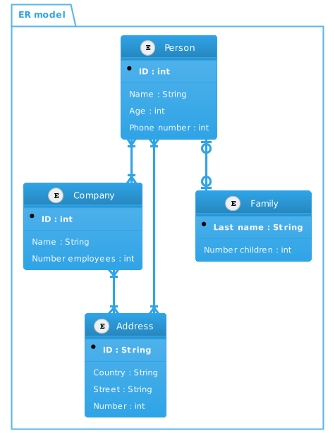

# plantuml

Usage Example Class Diagram 
```go
package main

import . "github.com/golangee/plantuml"
import "fmt"

func main(){
  fmt.Println(String(NewDiagram().
		Include(ThemeCerulean).
		Add(NewPackage("visual model").
			Add(NewClass("Dashboard").
				AddAttrs(
					Attr{Private, false, false, "id", "UUID"},
					Attr{PackagePrivate, true, false, "Stuff", "List<OtherStuff>"},
				),
			),
			NewPackage("domain model").
				Add(NewClass("A"),
					NewClass("B"),
					NewClass("SuperUser"),
					NewAbstractCLass("User").
						AddAttrs(
							Attr{Public, false, true, "Id", "UUID"},
							Attr{Protected, true, true, "Name", "string"},
							Attr{Public, false, false, "MyMethod(a,b string)", "(string, error)"},
						).
						Extends("SuperUser").
						Owns("A").
						Uses("B").
						NoteLeft(NewNote("Left\n<b>Note</b>")).
						NoteTop(NewNote("Top\n<b>Note</b>")).
						NoteRight(NewNote("Right\n<b>Note</b>")).
						NoteBottom(NewNote("Bottom\n<b>Note</b>")),
					NewInterface("Contract").
						AddAttrs(Attr{Public, true, false, "MyMethod()", ""}),
				),
			NewEnum("MetricType", "A", "Other", "Any", "of"),
		),
	))
}
```

Results in an output like this


Usage Example ER Model
```go
package main

import "fmt"
import . "github.com/golangee/plantuml"
func main(){
	fmt.Println(String(NewDiagram().
		Include(ThemeCerulean).
		Add(NewPackage("ER model").
			Add(NewEntity("Person", "E01").
				AddAttrs(
						Attribute{Name: "ID", DType: "int", Manda: true, Bold: true, Prime: true},
						Attribute{Name: "Name", DType: "String", Manda: false, Bold: false, Prime: false},
						Attribute{Name: "Age", DType: "int"},
						Attribute{Name: "Phone number", DType: "int"},
						)).
			Add(NewEntity("Company", "E02").
				AddAttrs(
					Attribute{Name: "ID", DType: "int", Manda: true, Bold: true, Prime: true},
					Attribute{Name: "Name", DType: "String"},
					Attribute{Name: "Number employees", DType: "int"},
					)).
			Add(NewEntity("Address", "E03").
				AddAttrs(
					Attribute{Name: "ID", DType: "String", Manda: true, Bold: true, Prime: true},
					Attribute{Name: "Country", DType: "String"},
					Attribute{Name: "Street", DType: "String"},
					Attribute{Name: "Number", DType: "int"},
					)).Add(NewEntity("Family", "E04").
						AddAttrs(
							Attribute{Name: "Last name", DType: "String", Manda: true, Bold: true, Prime: true},
							Attribute{Name: "Number children", DType: "int"},
							)).
			Add(NewConnectionList().
				AddConns(
					Connection{Start: "E01", Dest: "E02", FType: FOnMa, TType: TOnMa},
					Connection{Start: "E01", Dest:  "E03", FType: FOnMa, TType: TOnMa},
					Connection{Start: "E02", Dest:  "E03", FType: FOnMa, TType: TOnMa},
					Connection{Start: "E01", Dest: "E04", FType: FZeOn, TType: TZeOn},
					)))))
}

```

Results in an output like this


